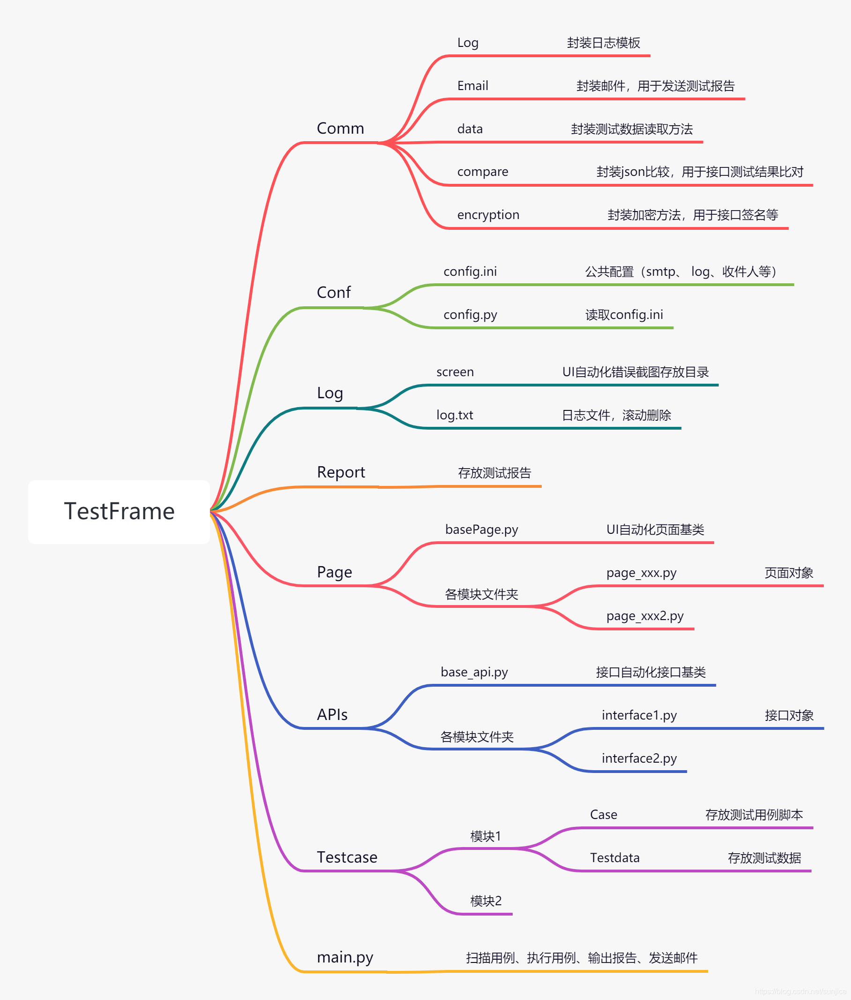

# 一些说明

## 打包命令

`pip freeze >requrements.txt`

命令执行后，会在当前目录生成一个requrements.txt的文件，然后再新的环境中执行

`pip install -r requirement.txt`

就可以一次安装所有的包了

## 解决导入自定义包时找不到的问题

可以在python的安装目录下，找到Lib文件夹下的site-packages文件夹，在site-packages文件夹下新建一个custom.pth文件，将当前项目根路径写在里面，如果有多个python项目都存在自定义包要导入，则custom.pth分多行依次写入项目的根路径

## 总体框架

